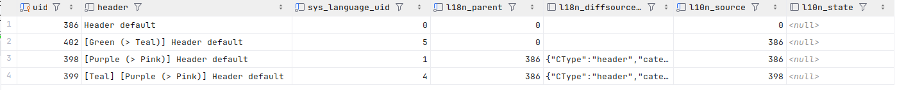
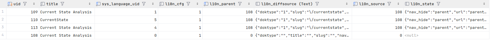

# 3. Current State Analysis

This chapter aims to present the key concepts and characteristics of translation handling in TYPO3, to outline their technical implementation and interactions, and to identify current limitations as well as opportunities for improvement. The analysis is based on the current TYPO3 version 13.4 (as of April 2025).

Due to its long history of multilingual support TYPO3 does not have a unified translation handling API.  
Instead, translation functionality is distributed across multiple implementations that combine legacy code and modern approaches. As a result translation handling mechanisms are often difficult to comprehend, challenging to modify, and susceptible to inconsistencies and complex errors ([TYPO3 Forge: Issues](https://forge.typo3.org/projects/typo3cms-core/issues?utf8=%E2%9C%93&set_filter=1&sort=id%3Adesc&f%5B%5D=status_id&op%5Bstatus_id%5D=o&f%5B%5D=tracker_id&op%5Btracker_id%5D=%3D&v%5Btracker_id%5D%5B%5D=1&f%5B%5D=category_id&op%5Bcategory_id%5D=%3D&v%5Bcategory_id%5D%5B%5D=1290&f%5B%5D=&c%5B%5D=tracker&c%5B%5D=status&c%5B%5D=priority&c%5B%5D=subject&c%5B%5D=assigned_to&c%5B%5D=category&c%5B%5D=fixed_version&group_by=&t%5B%5D=)).

The following analysis is primarily based on the work of the TYPO3 Translation Handling Initiative ([Translation Handling Initiative: Team Meeting Minutes Overview](https://notes.typo3.org/s/f3ae8fZSD#), [TYPO3 Translation Handling Initiative](https://typo3.org/community/teams/typo3-development/initiatives/translation-handling)), supported by the official TYPO3 Documentation and a talk about Overlays by Benni Mack on the TYPO3 Developer Days 2024 ([Benni Mack: Language Overlay](https://www.youtube.com/watch?v=8kB1IH-_-_s)).

## 3.0 Translation Areas in TYPO3

There are two principal areas in which translations are required in TYPO3:

**1. XLIFF Files:**

TYPO3 employs XLIFF files to manage backend user interface labels as well as generic frontend labels (e.g. "read more") ([TYPO3 Documentation: XLIFF Format](https://docs.typo3.org/m/typo3/reference-coreapi/13.4/en-us/ApiOverview/Localization/XliffFormat.html)).  
Although XLIFF handling forms part of TYPO3’s overall translation support, it addresses a distinct and comparatively less complex area. Accordingly, it is not the main focus of the following analysis.

**2. Editable Database Records:**

Editors can translate all editable content into all configured languages. Content in TYPO3 includes page records (database table `pages`), content element records (database table `tt_content`), core system records (such as `sys_file_reference` and `sys_file_metadata`), and records from third-party extensions (for example, `tx_news_domain_model_news`).

**Types of database records and their impact on translation handling:**

| Entity | Database Table | Affected Areas |
| --- | --- | --- |
| **pages** | `pages` | <ul><li>page rendering</li><li>page slug generation</li><li>menu rendering</li><li>link handling</li></ul> |
| **content elements** | `tt_content` | <ul><li>standard content rendering</li><li>content rendering via TypoScript</li></ul> |
| **core system records** | e.g. `sys_file_reference`, `sys_file_metadata` … | <ul><li>rendering of file resources</li><li>etc. ...</li></ul> |
| **custom database records** | e.g. `tx_news_domain_model_news` … | <ul><li>rendering of relations to `tt_content`, `pages`, core system records or custom records</li><li>rendering of Extbase Plugin content</li><li>record slug generation</li><li>language menu generation</li><li>record link handling</li></ul> |

## 3.1. TYPO3 Translation System Architecture

For each TYPO3 site (domain) any number of languages can be defined in the YAML Site Configuration. Each language is assigned a numeric identifier, a server locale, and either a URL or a path segment (see 3.3) ([TYPO3 Documentation: Add Languages](https://docs.typo3.org/m/typo3/reference-coreapi/13.4/en-us/ApiOverview/SiteHandling/AddLanguages.html)).

All configured languages are subsequently available in the backend for translation. Once a page is translated, content elements and other records on it can be translated too.  
Persistence is handled by the `DataHandler` object (see 3.3). It duplicates the full Default Language record and all its relations into their respective database tables, with additional information indicating language and origin (see 3.3).

Through the Table Configuration Array (`TCA`) fields can be excluded from translation. They are kept synchronized with the field value of their Default Language parent record, if such a connection exists, and do not have to be edited manually ([TYPO3 Documentation: l10n_mode](https://docs.typo3.org/m/typo3/reference-tca/13.4/en-us/Columns/#confval-columns-l10n-mode) ).

All records except pages may be translated with or without a connection to their Default Language parent record ("connected" or "free" backend translation mode, see 3.2). This connection provides the basis for frontend Overlays and Fallbacks and for preserving structure and sorting on translated pages.

In the frontend the current language configuration is available via the `LanguageAspect` object of the `Context` API. Depending on the configured `fallbackType` (see 3.3), Overlays and/or Fallbacks are applied through `PageRepository::getLanguageOverlay()`.

Custom implementations using the TYPO3 Extension Framework Extbase can use the same translation mechanisms by utilizing core functionality (see 3.3).

## 3.2. Key Concepts

### Default Language

The Default Language is the primary language of any TYPO3 Site with the fixed language identifier ` 0`. All other languages are considered translations.

This concept is firmly embedded in TYPO3: the Default Language determines the structure of the page tree and the Page Module in the backend and may also govern the structure and sorting of translated pages in the frontend, depending on configuration.

### All Languages

Records can be made visible in every language by choosing "All Languages" (`-1`) as value of the configured language field. In the backend language comparison view, "All languages" content elements are shown in the Default Language only.

### Translation Modes (Backend):

The translation mode of a page depends on how content elements are translated: either "connected" (with a reference to the Default Language parent record), "free" (independent), or "mixed" (a combination, which cannot easily be produced and is discouraged). The term "translation mode" is officially used only in the backend, specifically in the Page Module.

Connected mode is created by selecting "Translate" in the "Translate" modal of the backend user interface. Free mode is created by choosing "Copy." A single unconnected element causes the entire page to lose its connected status. Editors are informed of the current mode in the backend ([TYPO3 Documentation: Localized content](https://docs.typo3.org/m/typo3/guide-frontendlocalization/main/en-us/LocalizedContent/Index.html)).

The backend translation mode is not automatically synchronized with the `fallbackType` setting in the Site Configuration, which controls how content is rendered in the frontend. As a result, editors must manually ensure consistency between the translation mode used during content creation in the backend and the site-wide overlay/fallback configuration for the frontend.

### Overlays

TYPO3 uses overlays for both languages and workspaces. For language overlays, a record is first retrieved in the Default Language. If another language is requested, the corresponding translation is found via its reference to the Default Language parent record. The field values of the original record are then overlayed with those of the translation (see 3.3: *Data Rendering in the Frontend*).

### Fallbacks

Fallbacks are part of the overlay mechanism: if no translation exists for a record in the requested language, a configured fallback chain can be used to display a translation from another language. If none is found, the Default Language record is shown.

## 3.3. Technical Implementation

### Translation Process and Data Persistence in the Backend

#### Table Configuration Array (`TCA`)

In TYPO3 translations are duplications of an original Default Language record in the same database table. Translations are enabled per database table by adding specific language-related fields through `TCA`. These fields are used for storing and retrieving information about language and source of translated records ([TYPO3 Documentation: Language fields](https://docs.typo3.org/m/typo3/reference-tca/13.4/en-us/BestPractises/LanguageFields.html)).

**Language fields in TYPO3:**

| Key in TCA `ctrl` Section | Database Field Name | Description |
| --- | --- | --- |
| **languageField** | `sys_language_uid` | Language id from Site Configuration or `-1` for "all languages". |
| **transOrigPointerField** | `l10n_parent`/`l18n_parent` in `tt_content` | `uid` of the Default Language record. This field holds the connection to the Default Language record in connected backend translation mode. |
| **translationSource** | `l10n_source` | `uid` of the source record for translation (not necessarily the Default Language record). |
| **transOrigDiffSourceField** | `l10n_diffsource`/ `l18n_diffsource` in `tt_content` | This field stores original Default Language values. It is used for highlighting changes in the Default Language. |

Per default all fields containing text in a translated record must be edited manually in the backend to change content to the new language. All subsequent changes must be done manually for every language.

With the following `TCA` options, fields (of certain types) can be configured to be synchronized with the field value of the connected Default Language source record, if this connection exists. If applied, manual editing of translated values is not necessary or even possible anymore.

| Configuration Options | Description |
| --- | --- |
| `l10n_mode` | **exclude**: the field is excluded from backend editing and is synchronized with the Default Language value behind the scenes. **prefixLangTitle**: a prefix is added to the  content of a translated record on initial translation. It acts as a reminder that the value still needs translation. The field needs to be edited manually in the backend. |
| `allowLanguageSynchronization` | Enables the `LocalizationStateSelector` for this field in the backend: Editors can decide per record whether a field should be synchronized with the Default Language value. Sync status is stored in the database field `l10n_state`. |

#### Additional Configuration Options for Table `pages`

Since pages in Default Language are basic structuring elements of TYPO3, pages are the only records that can never be without a connection to a Default Language parent record. Due to this special status there are additional options for editors to influence frontend output behavior per page record in the Page Properties of a Default Language page record:

1. **"Hide default language of page"**
2. **"Hide page if no translation for current language exists"**

This configuration is stored in the additional database field `l18n_cfg` of table `pages`.

A global configuration also exists:

`$GLOBALS['TYPO3_CONF_VARS']['FE']['hidePagesIfNotTranslatedByDefault'] = true; `

If enabled, the above option 2 changes to: **"Show page even if no translation exists."**

#### Database Structure

The two following examples show the use of language fields in tables `tt_content` and `pages`:

1. **Table `tt_content`**

This example shows a Default Language record (`uid=386`) with three translations. Two of them (`uid=398`, `uid=399`) are connected to the Default Language parent (`l18n_parent=386`). One translation `uid=402` is unconnected (`l18n_parent=0`).

The record with `uid=399` was translated from the record with `uid=398 `as can be seen from the value of the field `l10n_source`. The source for the other translations was the Default Language record (`l10n_source=386`).

2. **Table `pages`**

This example also shows a Default Language record (`uid=108`) with three translations. All translations are connected to the Default Language parent (`l10n_parent=108`). In `TCA` `config → behaviour → allowLanguageSynchronization` is set to true for field `nav_hide`, among others, and the values of these fields are set to be synchronized with the values of the Default Language record (`l10n_state={"nav_hide":"parent", "url":"parent"…}`).

"Hide default language of page" is enabled (`l18n_cfg=1`).

#### `DataHandler` Object

The `DataHandler` object handles persistence of all records in backend context and is at the center of the TYPO3 core. In translation handling it is specifically responsible for:

- persisting translated records according to `TCA` configurations depending on mode ("Translate" or "Copy" in "Translate" backend modal)

- persisting translated records for all inline and m:n relations

- synchronizing field values depending on `TCA` configurations

- updating existing translations and their relations in ordinary copy/move processes

For all these actions workspaces need to be taken into account and special cases like Flexform field definitions need to be handled too.

In the DataHandler a command is called for each backend action that subsequently takes care of the necessary database updates/insertions. An additional object `RelationHandler` is used to process relations. Commands for translations are:

- `localize` for connected records

- `copyToLanguage` for unconnected records

Records can also be copied or moved to different languages, pages or even sites in the backend, with or without existing translations. Missing page translations, differing language configurations, language values of relations and existing translations have to be taken into account and handled.

### Data Rendering in the Frontend

Three different overlay types can be configured using option `fallbackType` in the Site Configuration.

This setting controls whether Overlays are applied and if they are, how records are handled when not available in the requested language:

- `fallbackType`: `fallback`

    - **Overlays** are applied

    - **Behavior for Missing Translations**: a fallback chain (list of language ids) can be defined via the option `fallbacks`. If no translation is found for a record in the requested language, the fallback chain is used to look for translations of this record in other languages, following the defined order. If no translations are found in any of the fallback languages either, the Default Language record is shown: this final fallback to the Default Language cannot be disabled.

- `fallbackType`: `strict`

    - **Overlays** are applied

    - **Behavior for Missing Translations**: no record is shown at all

- `fallbackType`: `free`

    - **Overlays** are not applied

Before rendering, all records are passed through the method`PageRepository::getLanguageOverlay()` to retrieve the final record from the `LanguageAspect` of the `Context` API, according to overlay type and fallback chain:

For Overlays all field values of the original database record – except for `uid` and `pid` – are replaced with values from the record in the requested language. Additional fields such as `_LOCALIZED_UID` are added to keep information about the translated record ([Benni Mack: Language Overlay](https://www.youtube.com/watch?v=8kB1IH-_-_s)).

For Fallbacks, an Overlay is done using a translated record from a language in the fallback chain instead of the requested language.

### Extension Development (Extbase)

In Extbase Frontend context, the `Typo3DbQueryParser` object is used to retrieve records from the database before they are automatically passed to the core method `PageRepository::getLanguageOverlay()`. When using custom SQL queries with `QueryBuilder`, records must be passed through `PageRepository::getLanguageOverlay()` manually.

In the backend, localized records can be retrieved using `BackendUtility::getRecordLocalizations()` or more recently, also via the `PageRepository`. ([Benni Mack: Language Overlay](https://www.youtube.com/watch?v=8kB1IH-_-_s))

For writing data, using the core `DataHandler` is recommended over Extbase’s `Typo3DbBackend` to ensure consistent translation handling. ([Benni Mack: Language Overlay](https://www.youtube.com/watch?v=8kB1IH-_-_s))

## 3.4. Translation Workflows for Editors

The TYPO3 core supports a manual translation workflow, primarily through the Page and List modules in the backend. The Info Module complements this by offering an overview of translated pages, their configuration, and the current backend translation mode via the "Localization Overview."

Various 3rd party extensions provide additional functionality. In recent years, several extensions, such as [**ai_suite**](https://extensions.typo3.org/extension/ai_suite) and [**wv_deepltranslate**](https://extensions.typo3.org/extension/wv_deepltranslate) have been developed to integrate TYPO3 with neural machine translation services like [DeepL](https://experimentation.deepl.com/en/translator) and [OpenAI](https://openai.com/), offering editors the option to streamline the translation process through automation.

For data exchange with translators and translation agencies the extensions [**l10nmgr**](https://extensions.typo3.org/extension/l10nmgr) and [**localizer**](https://extensions.typo3.org/extension/localizer) offer export/import and workflow automation functionality.

### Translating Pages

Pages are translated in the Page Module. The translation appears in a separate column beside the Default Language when the "Language Comparison" mode of the Page Module is chosen.

### Translating Content

Content elements and inline relations are also translated in the Page Module using the translated page’s "Translate" button. In the dialog that opens, editors can choose between "Translate" and "Copy" to create translated content either in "connected" or "free" backend translation mode.

### Translating Other Records

Records not managed as part of content elements are translated in the List Module using the "Localize to" buttons. By default, these translations are linked to their Default Language parent, though the connection can be removed manually.

### Import/Export Functionality (l10nmgr)

The [l10nmgr](https://extensions.typo3.org/extension/l10nmgr) extension allows the creation of XML or MS Excel files compatible with Computer assisted translation (CAT) tools used by translators and agencies. This enables translators to continue using the specialized tools of their systems – such as spell checkers or terminology databases – without requiring any knowledge of TYPO3.

Once translated, the files can be re-imported into the system. Translation workflows can be fully automated with the additional use of the [localizer](https://extensions.typo3.org/extension/localizer) extension.

## 3.5 XLIFF Labels

TYPO3 uses localizable strings throughout the backend user interface and in the frontend. These language labels are stored in XLIFF files, a standard format for the exchange with computer-assisted translation (CAT) tools. By convention, these files are located in the `Resources/Private/Language/` directory of an extension or core module.

Language file handling is managed through TYPO3’s "Localization API" ([TYPO3 Documentation: Localization API](https://docs.typo3.org/m/typo3/reference-coreapi/13.4/en-us/ApiOverview/Localization/LocalizationApi/Index.html). For each language configured in the Site Configuration, XLIFF files can be prefixed with the locale (`TYPO3\CMS\Core\Localization\Locale`) defined for that language. The file with the requested language's locale prefix will be used.

These locale prefixes also enable automatic fallback mechanisms ([Benni Mack: Multilanguage](https://b13.com/blog/multilanguage-use-any-locale-now-in-typo3-v12)) – for example, falling back from `de_AT` to `de_DE`. This process is handled by the `LanguageService` object, which is obtained via the `LanguageServiceFactory`. In Extbase context, the `LocalizationUtility` helper class is used.

Language files for core modules or for published TYPO3 extensions are translated via the cloud-based localization management platform [Crowdin](https://crowdin.com/). Currently, translations into more than 60 languages are supported. Updates from Crowdin can be retrieved via the Admin Tools Module in the TYPO3 backend.

XLIFF labels cannot be edited directly within the TYPO3 backend.

## 3.6. Identified Limitations and Challenges

### Technical Limitations

#### Persistence / DataHandler

Many open issues on [forge.typo3.org](https://forge.typo3.org) regarding translation handling concern the `DataHandler` . Specifically, recurring topics are how relations are processed and how Default Language values are synchronized (`l10n_mode=exclude`, `allowLanguageSynchronization`).

Because of the complex processes and many possible side effects, in many cases, there are no straight forward solutions and the expected behavior must be clarified first (e.g. [review 67172](https://review.typo3.org/c/Packages/TYPO3.CMS/+/67172)).

Changes in the historically grown codebase are difficult and prone to unintended side effects – despite the now high test coverage.

Also, existing behaviors and workarounds must be preserved following TYPO3's deprecation policy to maintain backward compatibility.

All of this makes bugfixes and refactoring in the `DataHandler` risky and time-consuming.

#### Frontend Output / Overlays

Language Overlays too are a source of many issues in TYPO3. They add complexity, require a large amount of database queries, and are difficult to understand as a concept.

There have long been ideas to eliminate Overlays in favor of directly querying translated records ([Oliver Hader: DataHandler & Workspaces](https://docs.google.com/presentation/d/1Bjcww19LQqh1vE3_RuqPOLkeVazBVPufGYgUOe0eQRI/edit?slide=id.g2f804253c2_0_8)). This would greatly simplify frontend output logic and relation handling. At the same time it would mean increasing data redundancy and introducing new complex synchronization mechanisms ([Translation Handling Initiative: 18.10.2024](https://notes.typo3.org/s/8vI0MnUbs#)).

#### Language Identifiers

For historical reasons TYPO3 uses numeric language identifiers rather than locales or language tags. This prevents the identification of languages across systems or sites. The fixed Default Language id value `0`, makes it difficult to work around this limitation by assigning unique ids across systems.

The identifier `-1` for “all languages” poses an additional inconsistency, complicating sorting and overlay logic ([Benni Mack: Language Overlay](https://www.youtube.com/watch?v=8kB1IH-_-_s)).

On the way to the modern approach of adopting standard language tags (e.g. BCP 47) the "all languages" functionality and value `-1` need to be replaced first. ([Translation Handling Initiative: 28.06.2024](https://notes.typo3.org/s/GQwWxdUKO#), [Translation Handling Initiative: 31.01.2025](https://notes.typo3.org/s/kEaZn6jJF#)).

Afterward the replacement of the fixed Default Language id ` 0` can be addressed. This again, is not straightforward ([issue 103905](https://forge.typo3.org/issues/103905), [review 84338](https://review.typo3.org/c/Packages/TYPO3.CMS/+/84338)): issues regarding sorting, copying between sites, and the special configuration for `pages` `l18n_cfg` need to be resolved first.

### Functional Limitations

#### Localisation depending on Country, Region or Market

For true localisation, content depends on regions or countries, rather than on languages alone ([Wikipedia: Language localisation](https://en.wikipedia.org/wiki/Language_localisation)). This can be reflected in TYPO3 by defining "languages" as language-country combinations, e.g. de-DE, de-AT, de-CH. Fallbacks can be configured to share most content among such "language groups".

Setups of this kind require substantial flexibility to address regional and data-specific demands, and the existing translation handling mechanisms in TYPO3 quickly reach their limits (e.g. fallback always to Default Language, no overwriting of Site Configuration per page, mandatory Default Language element if fallbacks are used …).

Moreover, countries, regions, or markets cannot currently be managed independently of languages. If such separation is required, custom solutions must be implemented.

#### Translation Modes and Fallback Types

TYPO3 enforces a single backend translation mode per language and page. Still, a mixed translation mode – where some content elements are independent while others stay connected – is a valid use case ([Translation Handling Initiative: 22.03.2024](https://notes.typo3.org/s/kqdwFxW1m#)). Supporting this is technically challenging due to sorting dependencies on Default Language records.

Also, the appropriate backend data structure for the configured Site Configuration `fallbackType` is not enforced (or even hinted at) in the backend. This can lead to unexpected behavior and is confusing for editors.

Currently, there is no configuration option available to override the Site Configuration `fallbackType` setting per page. This is only possible using Events provided by the `PageRepository`and requires advanced knowledge.

### User Experience Challenges

The following challenges regarding User Experience have mainly been identified on the basis of community feedback gathered by Eric Harrer and Jo Hasenau in the context of a workshop conducted on the TYPO3 Developer Days 2022 ([Translated and clarified TYPO3: Rethinking Translation Handling](https://docs.google.com/spreadsheets/d/1Y8KnuYxMoXyVaZzVHENBp_1fg2M-JGxHog6K3T9qn_Q/edit?gid=0#gid=0)) and a discussion with Daniel Held on March, 22nd 2024 ([Translation Handling Initiative: 22.03.2024](https://notes.typo3.org/s/kqdwFxW1m#)):

- **Backend translation modes** can be confusion for editors and can be difficult to handle, especially if it becomes necessary to switch mode. In addition, they are restricting and cannot always reflect valid use cases.

- The default **"[Translate to …]"** prefix, that is added on initial translation to indicate untranslated content is easy to overlook, and content may be published without proper translation.

- **Scroll position changes** when editing and closing or deactivating an element can disrupt the editing process, especially on pages with many languages.

- The **Default Language is always visible**, even for editors without access to it. This is unnecessary and takes up otherwise needed space.

- **Editors with access only to the Default Language** can restructure content, affecting other languages without realizing it. ([Translation Handling Initiative: 01.03.2024](https://notes.typo3.org/s/dYLClg7ji#))

- The **page tree cannot be translated**, and the page tree search only works with Default Language titles. This makes navigation harder for editors working in other languages.

- **Language visibility** in the Page Module is tied to access permissions only. There is no way to group or manage related variants (e.g., en-GB, en-US) for viewing and editing as language bundles in the backend user interface.

### Performance Issues

Currently, there are no major known issues with core translation handling, despite the significant number of database queries and recursive operations involved in overlaying and data persistence.

However, depending on the content structure, the number of languages, and the overall size of the site, performance bottlenecks may occur in the backend ([issue 10798](https://forge.typo3.org/issues/101798)) and with export/import operations ([l10nmgr: Known Problems](https://github.com/CodersCare/l10nmgr/blob/master/Documentation/KnownProblems/Index.rst)).

### Maintenance and Scalability Concerns

The rigid connection between language and localization makes it difficult to scale systems where content must vary not just by language but also by country, region, or market. Since these dimensions cannot currently be managed independently, editors and developers often resort to workarounds, increasing complexity and the potential for error.

Additionally, the lack of enforced consistency between backend translation modes and frontend fallback/overlay configurations can complicate maintenance in complex setups as the connection between backend and frontend is not always clear.

The reliance on the Default Language as the structural anchor makes major content restructuring time-consuming and technically challenging.

Finally, large sites with many languages and complex content structures can become difficult to manage, due to interface limitations and potential performance bottlenecks.